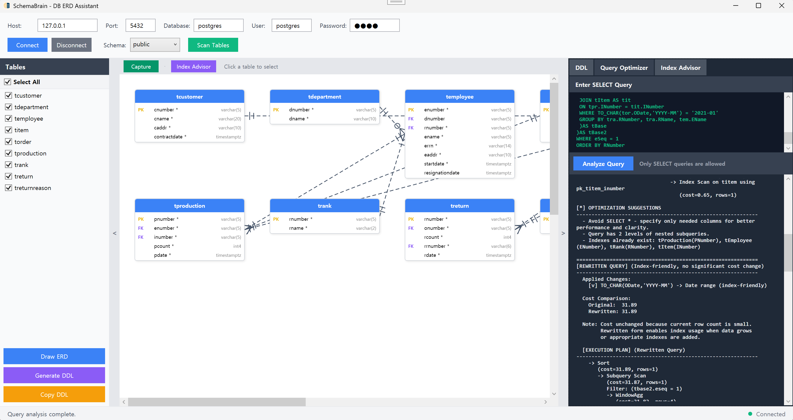

# 🚀 SchemaBrain  
### PostgreSQL ERD + Query Intelligence Assistant  

SchemaBrain is a **developer-first database intelligence tool** that helps you understand PostgreSQL schemas faster than any manual diagramming tool ever could.

It generates clean ERD diagrams, analyzes SQL queries, visualizes execution plans, and proposes optimization hints — all inside a simple UI.

> Think of SchemaBrain as  
> **“ERD engine + static analyzer + index advisor in one lightweight assistant.”**

---

## 📌 Why SchemaBrain?

Because existing tools are either:

❌ too visual and lack intelligence  
❌ too heavyweight for simple needs  
❌ too lightweight to be useful  

SchemaBrain exists for engineers who want:

✔ correct diagrams  
✔ insight on relationships  
✔ index-aware tuning feedback  
✔ reusable database artifacts  

---

## ✨ Core Features

### 🔍 Intelligent Schema Scan  
Connect to PostgreSQL and automatically extract:

- Tables  
- Columns  
- Primary / Foreign Keys  
- Relationship topology  

No manual modeling — SchemaBrain does the thinking.

---

### 🧩 Clean Auto-Generated ERD  
Produces usable, layout-aware crow-foot ERD diagrams.

Great for:

- onboarding  
- documentation  
- architecture handover  
- audit evidence  

---

### 🧠 Query Optimizer Assistant  
Paste a `SELECT` query — SchemaBrain:

✔ parses it  
✔ generates an execution plan  
✔ detects subquery depth / anti-index patterns  
✔ produces rewrite suggestions in natural language  

---

### 🔧 Index Advisor  
Detects implied or missing indexes inferred from:

- JOIN predicates  
- WHERE filters  
- GROUP BY expressions  

Provides actionable improvement hints.

---

### 📤 Export-Friendly  
Outputs metadata that can be reused in:

- docs  
- technical reports  
- system design artifacts  

---

## 🖥️ Live UI Preview

> Prototype screenshot below:



---

## 🚦 Current Status

✔ Fully working prototype UI  
✔ PostgreSQL schema scanning  
✔ Query analyzer active  

⚠ **Currently supports PostgreSQL only**  
Support for additional DB engines is on the roadmap.

---

## 🏗️ Target Users

SchemaBrain is built for:

- Backend developers  
- Database administrators  
- Solution architects  
- Technical writers  
- Startup engineering leaders  

If you’ve ever thought  
*“why doesn’t someone automate ER diagrams and SQL review?”*  
— this tool is for you.

---

## 🔮 Roadmap

Planned enhancements include:

- Support for SQL Server / MySQL / Oracle / SQLite  
- PDF / PNG ERD export  
- AI-assisted schema naming advisor  
- Natural language → ERD generation  
- Continuous schema drift detection  

---

## 🧰 Tech Stack

- C# / WPF  
- PostgreSQL metadata engine  
- Internal rule-based optimizer engine  
- ER auto layout generator  

---

## 🚀 Getting Started

Clone the repository:

```bash
https://github.com/SevenfingersStudio/SchemaBrain.git
